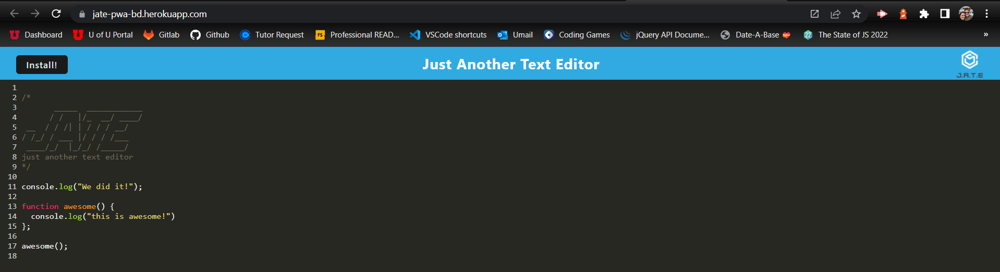
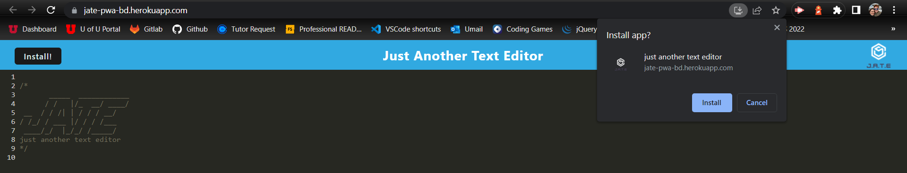
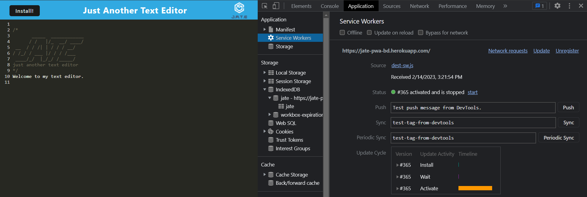

# Text Editor - Progressive Web Application

  

## Description
  
  This app is a progressive web application, meaning it can be downloaded directly to your device and used offline. Assets are cached so that a network connection is not required to access it. This text editor uses IndexDB in the backend to save user input. Each time it is opened it will automatically load the previous text input in the editor. 
  
  
## Table of Contents
  
- [Text Editor - Progressive Web Application](#text-editor---progressive-web-application)
  - [Description](#description)
  - [Table of Contents](#table-of-contents)
  - [Installation](#installation)
  - [Usage](#usage)
  - [Credits](#credits)
  - [License](#license)
  - [How to Contribute](#how-to-contribute)
  - [Tests](#tests)
  - [Questions](#questions)
  
  
## Installation
  
  To install this app, go to the deployed link here: https://jate-pwa-bd.herokuapp.com/ -- You can click on the Install button on the top left, or you can click on the download link on the top right directly through the browser. If you want to download the source code, clone this repo, then run the scripts in the root package.json file to install the dependencies and build the app. 
  
  
## Usage
  
  To use this app, follow the deployed link above, and use each new line to enter the desired text. You can use this to make lists, record code examples, or anything else! Use the install buttons to download the app directly to your device to use it even without a network connection. 

 

      
  
## Credits
  
  N/A
  
  
## License
  
  This software is licensed under the MIT license.
  
  ---
  
  
## How to Contribute
  
  N/A
  
  
## Tests
  
  N/A
  
  
## Questions
  
  Please forward any and all questions to benjaminmichaelday@gmail.com
  
  GitHub username: benmday